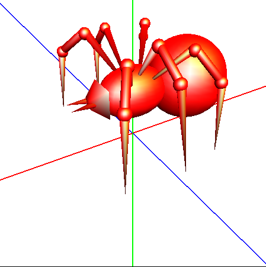
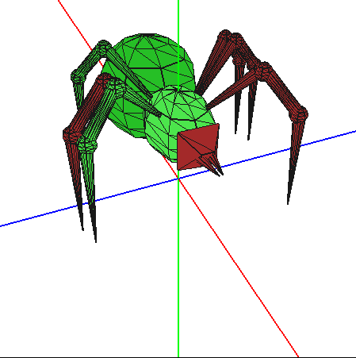
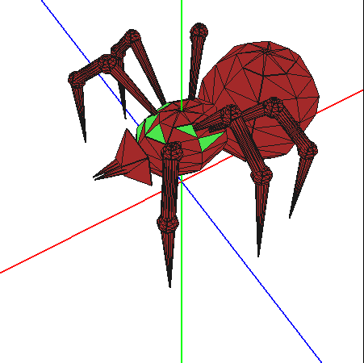

# OpenGL_Proyecto_IG

Partes 4 y 5 del Proyecto de la asignatura *Informática Gráfica*, donde se pretende realizar una escena con un objeto animado de elección propia, aplicando todo tipo de luces, materiales, selecciones y manipulación de ventanas y de la propia escena.
Todo ello usando la API de openGL en C++.
Las partes 1,2 y 3 se han omitido dado que las partes 4 y 5 incluyen a éstas. 

## Compilación y ejecución

Solo es necesario ejecutar *$make* en el directorio del proyecto y posteriormente *$./practica_objetos_B3 beethoven* (Notar que no debe ser *"beethoven.ply"*. Hemos de quitar la extensión *".ply"*

En cada directorio se encuentra un archivo *"LEEME.txt"* con instrucciones para la manipulación de la escena. 

## Algunas imágenes del proyecto

